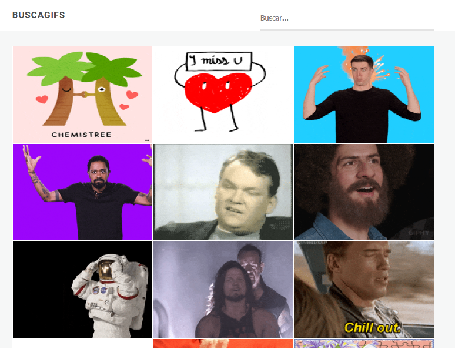

# BuscaGIFs
Un buscador de GIFs usando la API de Giphy.

[Probalo!](https://adperossa.github.io/buscagifs/)

## Descripción
Es una App super simple para demostrar el consumo de datos asincrónicos con React. Está estructurado en cuatro componentes más el contenedor global.

## TODO
* Crear fn reusable para evitar codigo duplicado entre busqueda y carga inicial
* Unificar ingles en metodos y variables a lo largo del codigo
